# Hi, I'm Freya Qian

<a href="https://github.com/Freya-Qian">
  <picture>
    <source media="(max-width: 600px)" srcset="assets/profile-ai-character-mobile-v3.svg">
    
  </picture>
</a>

Focused on turning large model capabilities into sustainable user value.

When evaluating an AI direction, the signal is not how impressive the demo looks, but the reality of the scenario, willingness to pay, and technical boundaries.

I use evidence and hypotheses to turn ambiguous technical possibilities into testable, reversible, and iterative product paths.

Technology is not the destination.

It is the lens for understanding systems, evaluating opportunities, and making better product decisions.

🌐 [Website](https://freya-qian.github.io/) · 📕 [Xiaohongshu](https://www.xiaohongshu.com/user/profile/5bcaaa97bb750a0001177fc1) · ✉️ [Email](mailto:1105qianhao@gmail.com)

---

## Featured projects

Products and tools built through an AI product lens.

  &nbsp;&nbsp;
  

 

## 项目

本地工具与独立探索，每个项目保留自己的内容和入口。

  <a href="https://github.com/Freya-Qian/Lingyu"><picture><source media="(max-width: 600px)" srcset="assets/project-cards/lingyu-white-logo-mobile-v2.svg">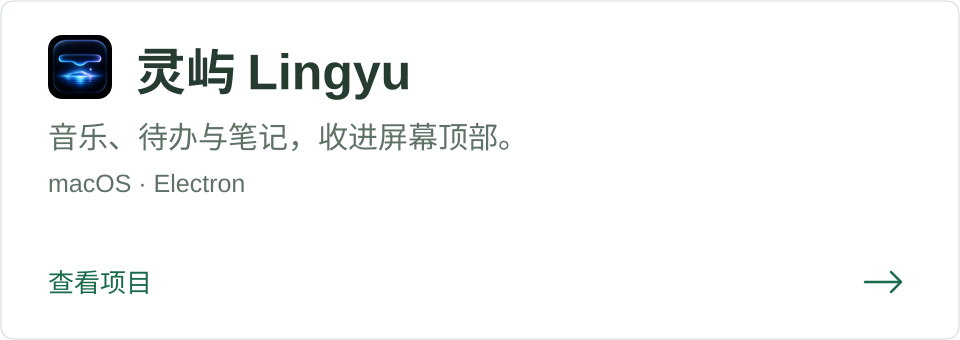</picture></a>&nbsp;&nbsp;
  <a href="https://github.com/Freya-Qian/AI-Avatar-Twin"><picture><source media="(max-width: 600px)" srcset="assets/project-cards/ai-avatar-twin-white-logo-mobile-v2.svg">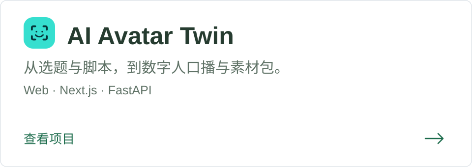</picture></a>

---

## AI Skills

  <a href="https://github.com/Freya-Qian/ai-pm-skill-evaluator"><picture><source media="(max-width: 600px)" srcset="assets/skill-cards/ai-pm-skill-evaluator-clean-mobile-v1.svg">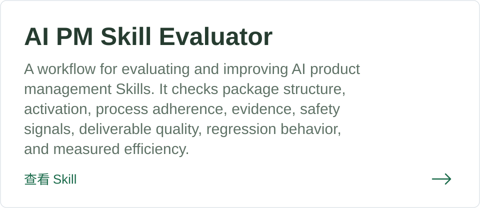</picture></a>&nbsp;&nbsp;
  <a href="https://github.com/Freya-Qian/ai-product-opportunity-evaluator"><picture><source media="(max-width: 600px)" srcset="assets/skill-cards/ai-product-opportunity-evaluator-clean-mobile-v1.svg">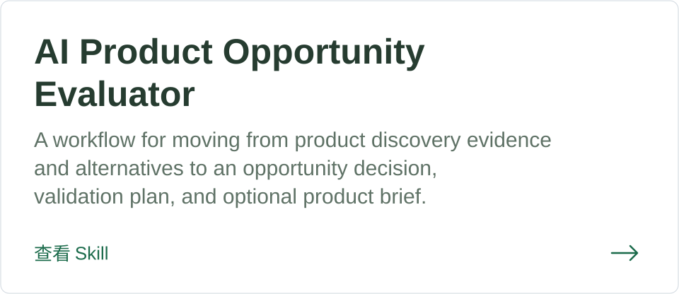</picture></a>

  <a href="https://github.com/Freya-Qian/agent-workflow-cost-diagnostician"><picture><source media="(max-width: 600px)" srcset="assets/skill-cards/agent-workflow-cost-diagnostician-clean-mobile-v1.svg">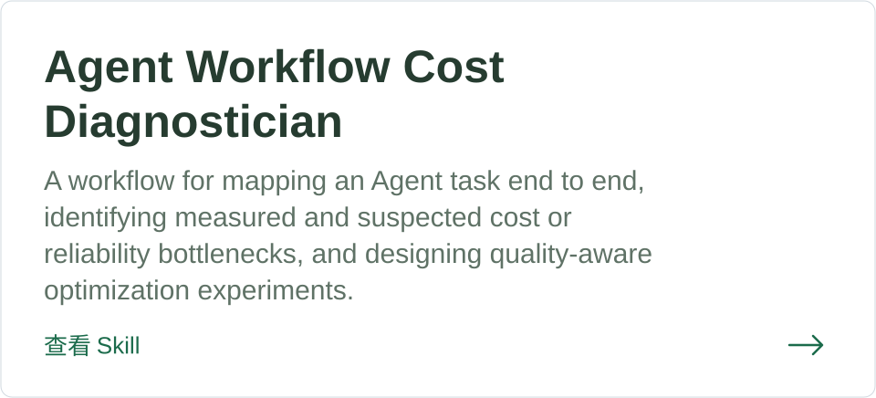</picture></a>&nbsp;&nbsp;
  <a href="https://github.com/Freya-Qian/data-to-decision-brief"><picture><source media="(max-width: 600px)" srcset="assets/skill-cards/data-to-decision-brief-clean-mobile-v1.svg">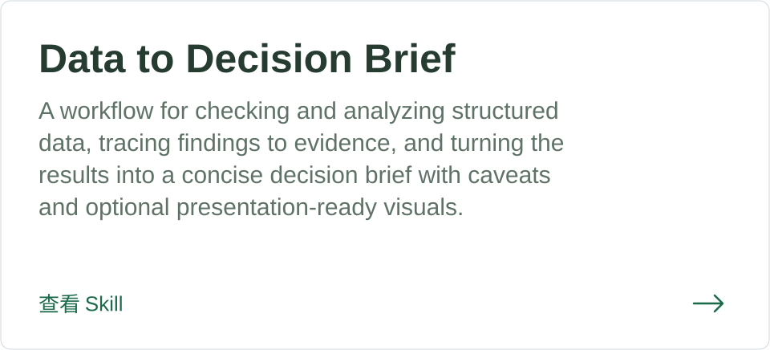</picture></a>

  <a href="https://github.com/Freya-Qian/creative-image-production"><picture><source media="(max-width: 600px)" srcset="assets/skill-cards/creative-image-production-clean-mobile-v1.svg">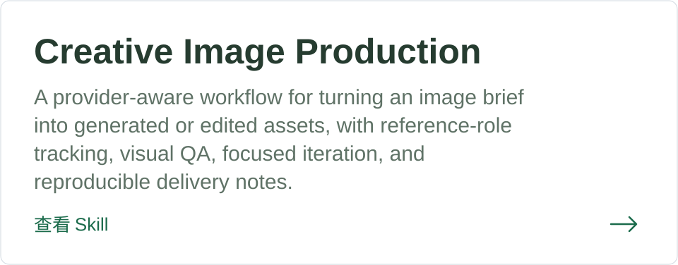</picture></a>&nbsp;&nbsp;
  <a href="https://github.com/Freya-Qian/model-evaluation"><picture><source media="(max-width: 600px)" srcset="assets/skill-cards/model-evaluation-clean-mobile-v1.svg">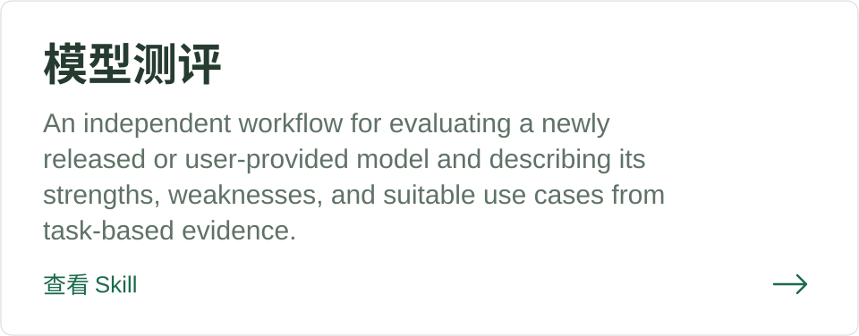</picture></a>

  <a href="https://github.com/Freya-Qian/model-selector"><picture><source media="(max-width: 600px)" srcset="assets/skill-cards/model-selector-clean-mobile-v1.svg">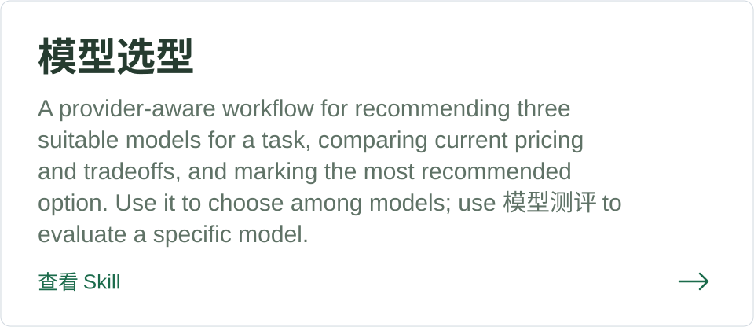</picture></a>

---

## 最近在写

I write about AI products through an engineering and product lens.

  <a href="https://mp.weixin.qq.com/s/0JuTnlmf1bpT2sETI3f_XQ">
    <picture>
      <source media="(max-width: 600px)" srcset="assets/article-cards/article-01-white-mobile-v3.svg">
      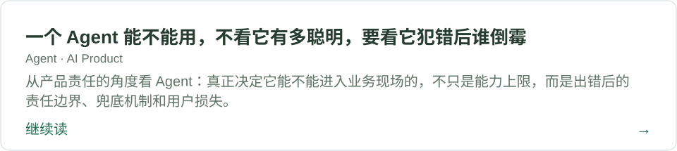
    </picture>
  </a>

  <a href="https://mp.weixin.qq.com/s/wNzVAq1kCvWNYwG3C6dSLA">
    <picture>
      <source media="(max-width: 600px)" srcset="assets/article-cards/article-02-white-mobile-v3.svg">
      
    </picture>
  </a>

  <a href="https://mp.weixin.qq.com/s/n7dILeLOh610bJsTMeYtWQ">
    <picture>
      <source media="(max-width: 600px)" srcset="assets/article-cards/article-03-white-mobile-v3.svg">
      
    </picture>
  </a>

  <a href="https://mp.weixin.qq.com/s/ANJtmf88fnIrBhuBT-K82w">
    <picture>
      <source media="(max-width: 600px)" srcset="assets/article-cards/article-04-white-mobile-v3.svg">
      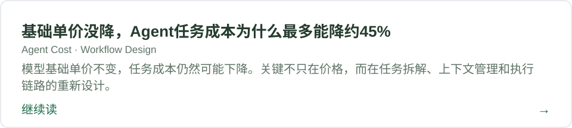
    </picture>
  </a>

  <a href="https://mp.weixin.qq.com/s/MUb2FaiS8fHlhU99ytRrEg">
    <picture>
      <source media="(max-width: 600px)" srcset="assets/article-cards/article-05-white-mobile-v3.svg">
      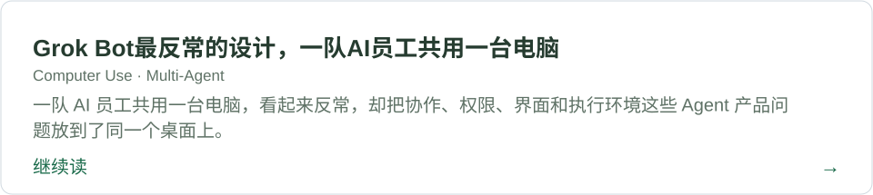
    </picture>
  </a>

  <a href="https://mp.weixin.qq.com/s/hfm_cyNzX1CWl0q0yaS3dw">
    <picture>
      <source media="(max-width: 600px)" srcset="assets/article-cards/article-06-white-mobile-v3.svg">
      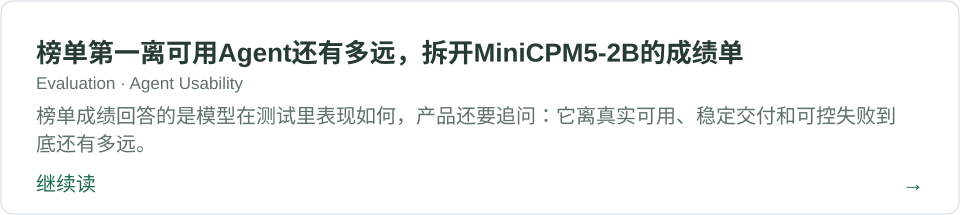
    </picture>
  </a>

  <a href="https://mp.weixin.qq.com/s/HCUtDnsF9qYlFZ84eY2gvQ">
    <picture>
      <source media="(max-width: 600px)" srcset="assets/article-cards/article-07-white-mobile-v3.svg">
      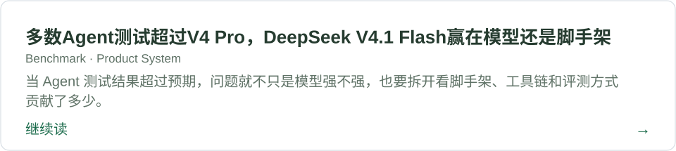
    </picture>
  </a>

  <a href="https://mp.weixin.qq.com/s/oc6y7H90HRNO9cjHAzPcIw">
    <picture>
      <source media="(max-width: 600px)" srcset="assets/article-cards/article-08-white-mobile-v3.svg">
      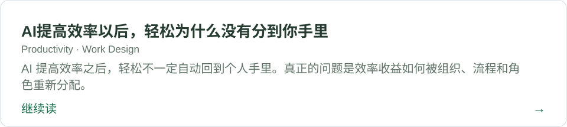
    </picture>
  </a>

---

## About

- 中文名：钱皓
- English name: Freya Qian
- AI Builder
- Project Manager with an embedded systems background
- Focused on AI products, agent workflows, and productizing emerging AI capabilities

---
