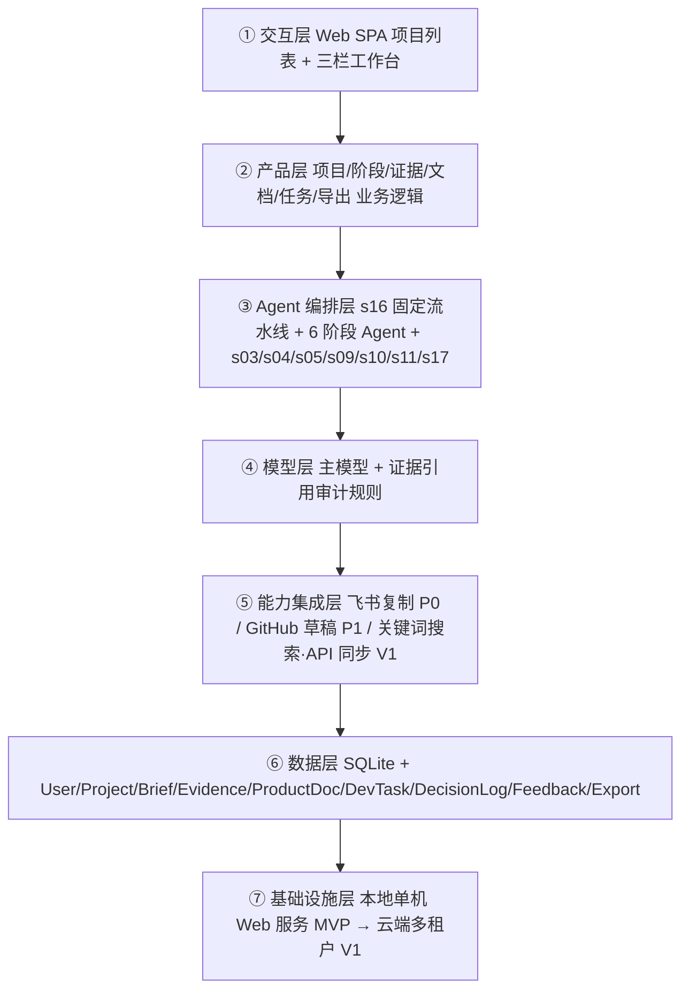

# AI 产品工厂 Web 端 PRD（优化版）

版本：V1.1（竞品通用化·修订版）
日期：2026-09-22
产品名称：AI 产品工厂
上一版本：V1.0（评审优化修订版）

> 本版本为 V1.0 的修订版，主要变更：①竞品从"内置固定竞品"改为"用户自选竞品（≤3 个）"；②移除对特定竞品的点名，改为通用竞品分析方法论（第 4 章）；③MVP 部署形态（本地优先 Web 单机版）、Agent 编排形态（s16 固定阶段流水线）、数据对象、导出三通道、非功能需求等沿用 V1.0 结论。
>
> 注：文档标题的「V1.1」是本文档修订版本号；第 15 章「版本规划」中的 MVP/V1/V2 是产品发布版本，两者独立，勿混淆。

---

## 1. 文档信息

| 项目 | 内容 |
|-|-|
| 产品名称 | AI 产品工厂 |
| 产品形态 | Web 端产品 |
| 文档类型 | PRD |
| 版本 | V1.1（竞品通用化修订版） |
| 目标版本 | MVP |
| 竞品策略 | 无固定竞品，由用户自选（≤3 个，见第 4 章） |
| 目标用户 | 产品经理、独立开发者、AI 项目学习者 |
| 核心目标 | 帮助用户在网页端把一个模糊产品想法推进成有竞品证据支撑、可评审、可开发、可交接的项目资料包 |

---

## 2. 背景与问题

用户经常有产品想法，但想法往往停留在一句话阶段。真正进入开发前，还需要经历需求澄清、竞品调研、产品定位、PRD 编写、MVP 范围定义、任务拆解和项目资料沉淀等步骤。

现有通用 AI 工具可以回答问题，各类 AI 工作台 / Agent 办公助手可以面向团队执行研究、文档、数据分析、网站或应用开发等多类办公任务。但对"从产品想法到开发交接"这个垂直场景来说，用户仍然缺少一个更聚焦、更轻量、更适合产品孵化流程的网页端工具。

本产品要解决的问题：

- 模糊想法无法快速转成结构化需求。
- 用户不知道下一步该问什么、查什么、写什么。
- PRD 容易变成模板化内容，缺少竞品证据和明确边界。
- 竞品调研、PRD、MVP 规划、任务拆解分散在不同文档中，无法串成闭环。
- 项目迭代时，老师反馈、用户反馈、决策依据和版本变化容易丢失。

---

## 3. 产品定位

AI 产品工厂是一个 Web 端 AI 产品孵化工作台。

用户输入一个模糊项目想法后，系统通过网页端引导式流程完成需求澄清、竞品证据整理、项目定位、PRD 生成、MVP 范围定义、研发任务拆解和项目资料包导出，让项目达到"可以进入评审或开发"的状态。

一句话定位：

> 面向产品经理、独立开发者和 AI 项目学习者的网页端 AI 产品孵化工作台，把一句想法变成可开发项目包。

核心机制（默认带竞品证据）：

> 系统在生成定位、PRD、MVP 和任务拆解前，先整理用户自选竞品的定位、功能、用户、流程、输出物和差异机会，并在关键结论中标注这些结论来自哪条竞品证据。**证据不足时不得编造结论，必须输出"待补证问题"。**

---

## 4. 竞品分析方法论（通用）

> 本产品是通用竞品分析工作台，不内置任何具体竞品。竞品由用户为自己的项目自选（**最多 3 个**），系统按以下方法论做结构化分析。

### 4.1 分析维度

竞品分析围绕 8 个维度展开，每个维度回答一个落地问题：

| 维度 | 要回答的问题 |
|-|-|
| 定位 | 竞品把自己定义成什么？面向谁？ |
| 用户 | 竞品的核心用户是谁？ |
| 场景 | 竞品主要解决什么场景下的什么问题？ |
| 流程 | 竞品的核心使用流程是什么？ |
| 输出物 | 竞品最终交付什么（文档/表格/网站/分析结果等）？ |
| 协作 | 竞品是否支持多人/团队协作？如何协作？ |
| 集成 | 竞品连接了哪些外部工具/平台？ |
| 差异机会 | 相对该竞品，用户的产品有哪些可切入的差异点？ |

### 4.2 竞品证据卡结构（source_url 必填）

| 字段 | 说明 | 必填 |
|-|-|-|
| 竞品名称 | 用户添加的竞品名称 | 是 |
| source_url | 证据来源链接 | **是（P0 校验）** |
| source_type | 官网、官方文档、公开文章、用户输入 | 是 |
| 证据类型 | 定位、功能、流程、定价、集成、用户、输出物、限制 | 是 |
| 原始摘录 | 原始材料摘要 | 是 |
| 结构化结论 | 从证据中提炼的结论 | 是 |
| 对本产品启发 | 可借鉴点、规避点、差异化机会 | 是 |
| 置信度 | 已确认、合理推断、用户补充、待核查 | 是 |
| 抓取时间 | 证据采集时间 | 是 |
| 引用状态 | 是否被定位、PRD、MVP 或任务拆解引用 | 是 |

### 4.3 引用与校验规则

- 竞品证据由用户添加（自选竞品 ≤3 个，贴网址抓取或手动填写）。
- PRD 中"为什么这样定位""为什么不做某功能""为什么第一版做这些功能"的结论，必须引用竞品证据或需求澄清结果。
- 证据不足时标记"待补证"，禁止编造确定性结论。
- **证据引用审计**：PRD 生成后自动校验——① 每个引用的 evidence_id 必须真实存在；② 每条证据的 used_in 与实际引用一致；③ 无证据支撑的关键结论输出为"无证据结论清单"进入待确认问题。
- 用户可新增竞品、修改或删除证据卡（删除需二次确认，见权限）。

---

## 5. 目标用户与场景

### 5.1 核心用户

| 用户类型 | 典型需求 |
|-|-|
| 产品经理 | 快速把模糊需求整理成可沟通、可评审、可开发的项目资料 |
| 独立开发者 | 有想法但缺少产品分析、竞品调研、PRD 和任务拆解能力 |
| AI 项目学习者 | 把课程项目、作品集项目或 GitHub 项目从想法推进到落地 |

### 5.2 核心场景

1. 用户输入一句产品想法，系统一步步追问并生成 PRD。
2. 用户基于自选竞品，梳理差异化定位。
3. 用户把 PRD 拆成 MVP 范围和开发任务。
4. 用户把项目资料包交给老师、队友、开发者或 AI coding 工具。
5. 用户根据反馈继续迭代，系统保留历史决策。

### 5.3 冷启动

- 新建项目页提供 3 个示例想法一键填入（如"做一个番茄钟 App"）。
- 需求澄清页每个问题提供回答提示。
- 内置 1 个示例项目，可一键克隆查看完整孵化链路。

---

## 6. 产品目标与成功指标

### 6.1 MVP 目标

完成网页端从想法到项目资料包的闭环：

```text
新建项目 → 输入项目想法 → AI 澄清需求 → 添加竞品并抓取证据
→ 生成产品定位和差异点 → 生成 PRD
→ 定义 MVP 范围 → 拆解研发任务 → 生成项目资料包
→ 导出 Markdown / 复制到飞书 / 生成 GitHub issue 草稿 → 根据反馈继续迭代
```

### 6.2 成功指标（过程 + 结果 + 采集点）

**过程指标（漏斗）：**

| 指标 | 采集点 |
|-|-|
| 项目创建完成率 | 前端埋点：新建项目提交 |
| 澄清完成率 | 后端：RequirementBrief 生成 |
| 竞品证据添加率 | 后端：Competitor/CompetitorEvidence 生成 |
| PRD 生成完成率 | 后端：ProductDoc 生成 |
| 资料包导出率 | 后端：Export 记录 |
| 任务拆解采纳率 | 前端：任务被复制/同步 |

**结果指标（证明"有用"）：**

| 指标 | 采集点（MVP 落地方式） |
|-|-|
| PRD 评审通过率 | 资料包页/迭代记录页手动标注"已评审通过"（正式评审流转放 V1） |
| 任务被采纳开发率 | 任务拆解页手动标记"已采用开发" |
| 资料包可独立阅读率 | 资料包页手动反馈"可独立阅读" |
| 想法→可开发项目转化时长 | 后端：项目各阶段时间戳 |

---

## 7. MVP 范围

### 7.1 MVP 包含

- Web 端项目列表和项目工作台（本地优先，单机部署）
- 新建项目与项目想法输入（含 3 个示例想法）
- 需求澄清 Agent（8 问模板 + 最多 2 轮追问）
- 竞品证据库（用户自选竞品 ≤3 个 + 贴网址抓取生成证据卡）
- 产品定位与差异点生成
- 带证据引用的 PRD 生成与章节编辑
- MVP 范围和版本规划
- 研发任务拆解
- 项目资料包导出（Markdown P0 / 飞书复制友好格式 P0 / GitHub issue 草稿 P1）
- 基础项目知识库和迭代记录（DecisionLog）
- 证据引用审计

### 7.2 MVP 不包含

- 账号体系与多项目云端保存（放 V1；MVP 本地单机 + 导出/导入）
- 飞书 / GitHub 真实 API 同步（放 V1）
- 竞品关键词自动搜索（放 V1，需搜索 API；MVP 已支持贴网址抓取）
- 完整多租户企业后台
- 复杂团队权限、预算和 ROI 管理
- 通用办公场景 Skills 市场
- 可视化 Agent 工作流画布
- 自动 coding agent、全自动部署和上线
- 深度原型编辑器

---

## 8. 关键决策

| 决策项 | 结论 | 理由 |
|-|-|-|
| 部署形态 | MVP = 本地优先 Web 单机版 + 本地后端服务 + SQLite 持久化 + 项目导出/导入（非纯前端 localStorage） | 先验证垂直闭环，账号/云端复杂度后移 V1 |
| 编排形态 | MVP = s16 固定阶段流水线，6 个 Agent = 6 个阶段处理器，统一 Orchestrator 顺序调用 | 孵化链路固定、可预期、可验收；自主编排放 V2 |
| 竞品策略 | 无固定竞品；用户自选竞品 ≤3 个，贴网址抓取生成证据卡 | 产品通用化，不绑定特定竞品；名称自动搜索放 V1 |
| 导出三通道 | Markdown（P0）、飞书复制友好格式（P0，不调 API）、GitHub issue 草稿（P1，不调 API）；真实 API 同步统一放 V1 | 划清"复制/草稿"与"同步"边界，避免范围打架 |
| 账号与数据 | 数据模型预埋 User 表与 Project 归属；MVP 用匿名本地用户 | 未来迁移云端不返工 |
| 模型提供方式 | MVP 用户自备 API Key（设置页配置），平台不承担模型成本（已决策） | 降低 MVP 成本与合规门槛；平台托管模型放 V1 |

---

## 9. Web 端信息架构

### 9.1 一级导航（MVP 收敛为两项）

- **项目**（主入口：项目列表 + 项目工作台）
- **设置**（模型配置：用户填自己的 API Key、本地数据导出/导入、关于）

> 说明：V0.3 的"模板/竞品库/资料包"不再作为全局一级导航，而是项目工作台内的阶段/资产；"设置"在 MVP 为真实页面（承载本地持久化与导出/导入）。

### 9.2 项目工作台布局（三栏）

| 区域 | 内容 |
|-|-|
| 左侧阶段栏 | 概览、需求澄清、竞品分析、PRD、MVP、任务拆解、资料包、迭代记录 |
| 中间工作区 | 当前阶段的输入、AI 输出、编辑器和确认操作 |
| 右侧上下文栏 | 项目摘要、关键决策、引用资料、待确认问题 |

### 9.3 核心页面

| 页面 | 说明 |
|-|-|
| 项目列表页 | 项目名称、状态、阶段、更新时间；新建/克隆/导入项目 |
| 新建项目页 | 输入想法（含 3 个示例）、选择项目目标 |
| 项目概览页 | 项目定位、当前进度、关键风险和下一步 |
| 需求澄清页 | AI 提问、用户回答（含提示）、生成需求摘要 |
| 竞品证据页 | 竞品证据卡（用户自选 ≤3 个）、对比分析、待补证项；新增竞品 |
| PRD 编辑页 | 生成、编辑、重写、确认 PRD 章节，展示引用证据 |
| MVP 规划页 | 按 MVP / V1 / 暂不做拆分功能 |
| 任务拆解页 | 生成研发任务、优先级、依赖、验收标准 |
| 资料包页 | 汇总内容并导出（Markdown / 飞书 / GitHub 草稿） |
| 迭代记录页 | 历史输入、反馈、版本变化、决策记录 |

---

## 10. 核心功能需求

### 10.1 项目列表与新建项目

- 创建项目，填写名称和一句话想法（提供 3 个示例一键填入）。
- 选择项目目标：课程作业、作品集、真实开发、团队评审（每种目标对应不同 PRD 章节权重，见知识库）。
- 竞品由用户自选（名称 + 链接，最多 3 个）。
- 查看当前阶段和最近更新时间；支持克隆示例项目。

验收标准：1 分钟内创建项目；创建后自动进入需求澄清页；列表展示阶段与更新时间。

### 10.2 需求澄清 Agent（澄清协议）

澄清协议：

- 首轮按 8 问模板生成问题：目标用户、场景、痛点、边界、成功指标、非目标、外部系统/数据源、领域知识来源。
- 最多 2 轮追问，逐条回答，可跳过（跳过项标记"待确认"）。
- 澄清完成判定：用户主动结束，或 2 轮结束，或关键项（目标/用户/成功指标）已覆盖。
- 自动生成结构化需求摘要（结构 = RequirementBrief 字段），可编辑、可确认后进入下一阶段。

验收标准：输入一句模糊想法后生成不少于 8 个针对性问题；回答后生成结构化摘要；摘要可编辑、可确认。

### 10.3 竞品证据库

- 竞品由用户添加（≤3 个）：填名称 + 可选链接，或贴网址抓取生成证据卡。
- 支持新增竞品名称、链接、描述、原始摘录和参考点；拆成证据卡。
- 证据标记类型：定位、功能、流程、集成、输出物、定价、用户、限制。
- 证据标记置信度：已确认、合理推断、用户补充、待核查。
- source_url 必填 + 格式校验（http/https）。
- 生成多竞品对比表、差异化机会。
- 证据可引用到定位、PRD、MVP、任务；展示"当前 PRD 使用了哪些证据"。
- 证据不足时生成"待补证问题"，不编造结论。

验收标准：生成多竞品对比表；对比维度含定位、用户、场景、流程、输出物、协作、集成、差异机会；每条证据卡含 source_url、结构化结论、启发；竞品结论能被 PRD 引用。

### 10.4 产品定位与差异点生成

- 生成一句话定位、目标用户、核心价值主张、相对自选竞品的差异化、不做什么。
- 展示定位结论引用了哪些需求摘要和竞品证据。

验收标准：定位不是泛泛的"AI 工作台"；明确"Web 端"和"产品孵化"；每个核心差异点至少引用 1 条竞品证据或需求证据。

### 10.5 PRD 生成与编辑（含证据引用审计）

- 一键生成完整 PRD；按章节重写；输入反馈后修订；查看版本记录。
- 章节旁展示引用证据；识别无证据关键判断并标记"待确认"。
- **证据引用审计**（生成后自动执行）：校验 evidence_id 存在性、used_in 一致性、无证据结论清单。

PRD 必须包含：背景与问题、产品定位、竞品证据与分析、用户与场景、Web 端信息架构、核心流程、功能需求、数据对象、验收标准、版本规划、风险与待确认问题。

验收标准：PRD 体现 Web 端页面和交互流程；包含竞品对比；定位/差异化/MVP 取舍展示证据来源；包含 MVP 不做范围；无证据判断进入待确认问题。

### 10.6 MVP 范围与版本规划

- 功能拆成 MVP、V1、V2、暂不做；标注用户价值、开发复杂度、依赖。
- 说明第一版选择理由与竞品差异化边界。

验收标准：MVP 支撑完整闭环；暂不做范围清晰；每个暂不做项说明原因（超出垂直场景/成本过高/竞品强势/证据不足/非 MVP 必需）。

### 10.7 研发任务拆解

- 按前端、后端、AI、数据、集成、测试拆解；生成优先级、描述、输入输出、验收标准。
- 支持复制为 GitHub issue 草稿（P1）；任务来源追溯到 PRD 章节、MVP 决策或竞品证据。

验收标准：每个任务可独立理解、有明确验收标准；任务顺序体现依赖；P0 任务能追溯到 PRD 章节或 MVP 决策。

### 10.8 项目资料包导出

资料包包括：项目简介、需求澄清摘要、竞品证据与分析、产品定位和差异点、带证据引用的 PRD、MVP 范围、研发任务拆解、待确认问题、迭代记录、**交接说明**。

三通道边界：

| 通道 | MVP 能力 | 后续 |
|-|-|-|
| Markdown | P0：导出可独立阅读的 Markdown | — |
| 飞书复制 | P0：生成复制友好格式（人工粘贴，不调 API） | V1：真实 API 同步 |
| GitHub issue | P1：生成 issue 草稿文本（不调 API） | V1：真实 API 同步 |

验收标准：支持 Markdown 导出；支持复制到飞书；支持生成 GitHub issue 草稿；导出内容可脱离产品独立阅读；包含"证据来源与引用说明"章节。

### 10.9 端到端验收（一次完整交付）

给定一句模糊想法，用户应能完成：

1. 新建项目并输入想法（含示例一键填入）。
2. 需求澄清 Agent 生成 ≥ 8 个问题，用户回答（可跳过）。
3. 生成可编辑的需求摘要并确认。
4. 添加竞品（≤3 个）并生成竞品对比与证据卡。
5. 生成产品定位与差异点（每个差异点有证据引用）。
6. 生成带证据引用的 PRD（自动跑证据引用审计，输出无证据结论清单）。
7. 生成 MVP 范围与研发任务（P0 可追溯到 PRD 章节）。
8. 导出 Markdown 资料包，可脱离产品独立阅读。

质量验收：PRD 关键结论有证据引用；无证据判断标记为待确认；导出资料包含"证据来源与引用说明"。

体验验收：从想法到资料包全流程在 1 个会话内走通；每阶段失败可重试且进度不丢失。

---

## 11. 数据对象（补齐版）

### 11.1 User（新增）

| 字段 | 说明 |
|-|-|
| user_id | 用户 ID（MVP 匿名本地用户，预留迁移） |
| created_at | 创建时间 |

### 11.2 Project

| 字段 | 说明 |
|-|-|
| project_id | 项目 ID |
| user_id | 所属用户 |
| name | 项目名称 |
| idea | 原始项目想法 |
| goal_type | 项目目标类型（course/portfolio/real/team_review） |
| default_competitor_id | 主竞品（可选，用户选定的主参照竞品，可为空） |
| current_stage | 当前阶段（枚举：idea→clarify→competitor→position→prd→mvp→tasks→package）；固定流水线顺序推进，前一阶段产物确认后进入下一阶段，支持手动回退重生成 |
| status | 项目状态（draft/active/done） |
| created_at / updated_at | 创建/更新时间 |

### 11.3 RequirementBrief

| 字段 | 说明 |
|-|-|
| project_id | 所属项目 |
| one_liner | 一句话定义 |
| target_users / scenarios / pains / goals / non_goals / success_metrics / external_systems / knowledge_sources / open_questions | 澄清结果（external_systems=外部系统/数据源，knowledge_sources=领域知识来源） |
| version | 版本 |
| status | draft / confirmed |
| source | 来源（澄清回答） |

### 11.4 Competitor / CompetitorEvidence

Competitor：competitor_id、project_id、name、url、positioning、target_users、key_features、strengths、gaps。

CompetitorEvidence（source_url 必填）：

| 字段 | 说明 |
|-|-|
| evidence_id / competitor_id / project_id | 标识与归属 |
| source_type / source_url | 来源类型与链接（必填） |
| evidence_type | 定位/功能/流程/集成/输出物/定价/用户/限制 |
| raw_excerpt / structured_claim / implication | 摘录/结论/启发 |
| confidence | 已确认/合理推断/用户补充/待核查 |
| used_in | 引用位置 |
| fetched_at / created_at | 抓取/创建时间 |

### 11.5 ProductDoc（结构化章节）

| 字段 | 说明 |
|-|-|
| doc_id / project_id | 标识 |
| doc_type | 文档类型 |
| version | 版本 |
| sections | 结构化章节数组（chapter_id、title、content、evidence_refs[]、status） |
| evidence_refs | 全文档证据引用汇总 |
| created_at | 创建时间 |

### 11.6 DevTask

| 字段 | 说明 |
|-|-|
| task_id / project_id | 标识 |
| module / title / description | 模块与任务 |
| priority | 优先级 |
| acceptance_criteria | 验收标准 |
| dependencies | 依赖任务 |
| source_refs | 来源引用 |
| export_status | 导出状态 |

### 11.7 DecisionLog

| 字段 | 说明 |
|-|-|
| log_id / project_id | 标识 |
| decision / reason / source | 决策/原因/来源 |
| evidence_refs | 关联证据 |
| created_at | 创建时间 |

### 11.8 Feedback（新增，支撑迭代记录）

| 字段 | 说明 |
|-|-|
| feedback_id / project_id | 标识 |
| content / affected_sections | 反馈内容与影响章节 |
| author_type | 老师/用户/系统 |
| created_at | 创建时间 |

### 11.9 Export（新增，支撑导出埋点）

| 字段 | 说明 |
|-|-|
| export_id / project_id | 标识 |
| channel | markdown / feishu_copy / github_issue |
| status / created_at | 状态与时间 |

---

## 12. AI Agent 设计（固定阶段流水线）

> MVP 采用 s16 固定阶段流水线：6 个 Agent = 6 个阶段处理器，由统一 Orchestrator 顺序调用；不做自主 Agent 团队（自主编排是 V2 能力）。

| 阶段 | Agent（阶段处理器） | 职责 |
|-|-|-|
| 需求澄清 | 需求澄清 Agent | 8 问模板提问、整理结构化需求 |
| 竞品证据 | 竞品证据 Agent | 维护用户自选竞品证据卡（source_url + 置信度）、对比与差异 |
| 定位 | 定位 Agent | 基于需求证据 + 竞品证据生成定位、差异点、非目标 |
| PRD | PRD Agent | 生成/修订带证据引用的 PRD，触发证据引用审计 |
| 任务拆解 | 项目经理 Agent | 拆解 MVP、研发任务、验收标准 |
| 记忆 | 记忆 Agent | 保存反馈、决策、版本变化（DecisionLog） |

输出原则：

- 所有输出围绕 Web 端产品形态。
- PRD 关键结论必须引用需求澄清或竞品证据。
- MVP 不扩张成通用 AI 工作台。
- 每个任务可执行、可验收。
- 无证据时输出待确认问题，不伪造确定性判断。

---

## 13. 核心流程

### 13.1 首次使用流程

1. 进入 Web 首页（项目列表）。
2. 点击"新建项目"，输入想法（或点示例一键填入）。
3. 选择项目目标。
4. 进入需求澄清，回答 8 问（可跳过）。
5. 生成需求摘要，确认后进入竞品证据页。
6. 添加竞品（≤3 个，贴网址抓取或手动填写），确认证据卡。
7. 生成产品定位与差异点。
8. 生成带证据引用的 PRD（自动跑证据引用审计）。
9. 生成 MVP 与任务拆解。
10. 导出资料包（Markdown / 飞书复制 / GitHub 草稿）。

### 13.2 反馈迭代流程

1. 用户在 PRD 或资料包页输入反馈。
2. 系统识别反馈影响模块（Feedback.affected_sections）。
3. 系统提示需更新章节。
4. 用户确认后生成新版本（ProductDoc.version +1）。
5. 系统记录变更原因与版本差异（DecisionLog）。

---

## 14. 技术架构（五要素 + 组件选型 + 七层）

### 14.1 五要素

| 要素 | 内容 |
|-|-|
| 工具 | 竞品资料抓取（贴网址 P0 / 关键词搜索 V1）、飞书复制友好格式导出（P0）、GitHub issue 草稿（P1）、文档/任务写入 |
| 知识 | 8 问模板、PRD 章节模板（按 goal_type 区分权重）、竞品分析方法论、评审标准、任务拆解模板 |
| 观察 | 阶段状态、证据引用审计结果、导出结果、用户编辑/反馈 |
| 行动 | LLM 生成（问题/摘要/定位/PRD/MVP/任务）、结构化写入数据对象、导出三通道 |
| 权限 | 项目数据读写隔离、竞品证据删除/修改（二次确认）、导出动作、外部 API 写操作（V1 需审批） |

### 14.2 组件选型（MVP）

| 组件 | 选否 | 依据 |
|-|-|-|
| s01 Agent Loop / s02 工具系统 | ✅ | 一切基础 |
| s03 权限系统 | ✅ | 证据删除/修改、导出、外部写操作 |
| s04 钩子系统 | ✅ | 证据引用审计、生成前后埋点/校验 |
| s05 任务规划 / s10 任务系统 | ✅ | 固定阶段 + 研发任务持久化与依赖 |
| s07 技能加载 | ✅ | PRD/8 问/评审模板按阶段加载 |
| s09 记忆系统 | ✅ | DecisionLog 决策记忆 |
| s11 后台任务 | ✅ | PRD 生成/导出慢操作 |
| s15 集成 Harness | ✅ | 多机制归一到单一循环 |
| s16 工作流运行时 | ✅ | 固定阶段流水线（B3 决策） |
| s17 目标闭环 | ✅ | "资料包可评审/可开发"完成判定 + 待确认交还用户 |
| s06/s08/s12/s13/s14 | ❌ 或 ⏸ | MVP 固定流水线、阶段上下文小、无定时；MCP 待 V1 评估 |

### 14.3 分层架构（7 层）



数据流（贯穿各层）：用户在 ① 输入想法 → ② 创建项目并进入阶段 → ③ Orchestrator 按固定流水线调用阶段 Agent → ④ 模型生成内容、规则引擎做证据引用审计 → ⑤ 需要时写文件/生成导出格式 → ⑥ 持久化数据对象与版本 → ⑦ 单机服务承载，导出文件可带走。

安全边界：本地数据隔离（①）、证据删除/导出二次确认（③）、外部 API 写操作审批（⑤）。
可观测性：阶段状态与耗时（③）、模型调用 token/成本（④）、导出与引用审计结果（⑤）、数据版本与日志（⑥）。

---

## 15. 版本规划

### MVP

| 模块 | 能力 |
|-|-|
| 项目管理 | 项目列表、新建项目（示例想法）、项目状态、本地持久化与导出/导入 |
| 需求澄清 | 8 问模板、最多 2 轮追问、需求摘要 |
| 竞品证据 | 用户自选竞品（≤3）、贴网址抓取证据卡、多竞品对比、证据引用审计 |
| PRD | 生成/编辑带证据引用的 Web 端 PRD |
| MVP 规划 | 功能优先级、版本边界、非目标 |
| 任务拆解 | 研发任务、验收标准、GitHub issue 草稿（P1） |
| 导出 | Markdown（P0）、飞书复制友好格式（P0）、带证据来源的资料包 |

### V1

- 账号体系与多项目云端保存。
- 竞品关键词自动搜索与结构化分析（搜索 API）。
- 飞书文档真实同步、GitHub issue API 同步（OAuth + 最小 scope + 撤销机制）。
- PRD 版本差异对比、项目模板库、证据引用图谱。

### V2

- 可运行 Web 原型生成、团队协作和评论、自定义 Agent 流程、项目 ROI 和进度分析、与 coding agent 深度衔接。

---

## 16. 研发任务拆解

### P0

| 模块 | 任务 | 验收标准 |
|-|-|-|
| 前端 | Web 端项目列表页 | 查看项目列表与当前阶段 |
| 前端 | 新建项目页（含示例想法） | 输入想法并创建项目，示例可一键填入 |
| 前端 | 项目工作台三栏布局 | 阶段导航、工作区、上下文栏可用 |
| 前端 | 竞品证据页 | 添加竞品（≤3）、查看证据卡、置信度、引用状态 |
| AI | 需求澄清问题生成（8 问模板） | 输入想法后生成不少于 8 个结构化问题 |
| AI | 需求摘要生成 | 回答后生成可编辑摘要 |
| AI | 竞品证据卡生成（贴网址抓取） | 输出证据卡、待补证项 |
| AI | PRD 生成 + 证据引用审计 | 生成带证据引用的 PRD，并输出无证据结论清单 |
| AI | MVP 和任务拆解 | 输出版本规划和研发任务 |
| 数据 | 数据模型与本地持久化 | User/Project/Brief/Evidence/ProductDoc/DevTask/DecisionLog/Feedback/Export 可持久化 |
| 导出 | Markdown 资料包导出 | 可独立阅读，含证据来源说明 |

### P1

| 模块 | 任务 | 验收标准 |
|-|-|-|
| 前端 | PRD 章节编辑 | 可编辑和重写单个章节 |
| 前端 | 迭代记录页 | 查看版本和反馈记录 |
| 集成 | 飞书复制格式优化 | 复制后保持清晰结构 |
| 集成 | GitHub issue 草稿 | 每个任务可复制为 issue 格式（不调 API） |
| 数据 | 证据引用关系可视化 | 查看 PRD 章节和任务引用了哪些证据 |

### P2

| 模块 | 任务 | 验收标准 |
|-|-|-|
| 调研 | 竞品关键词自动搜索 | 输入名称后自动搜索并生成竞品摘要（对应 V1 功能） |
| 原型 | 生成 Web 原型结构 | 根据 PRD 输出基础可预览页面 |
| 协作 | 评论和多人协作 | 支持团队评审 |

---

## 17. 非功能需求（本版新增）

| 维度 | 要求 |
|-|-|
| 时延 SLA | 需求澄清首轮问题生成 ≤ 15s；PRD 生成 ≤ 3min（后台任务，非阻塞） |
| 并发 | MVP 单机单用户为主，支持同机多标签页；任务队列串行 |
| 成本预算 | 单项目从想法到资料包 ≤ 预算上限（可配置）；每阶段记录 token 用量 |
| 可用性 | 关键阶段失败可重试，进度断点续跑；导出失败可重试 |
| 数据安全 | 项目资料为敏感数据，本地持久化；导出文件不包含密钥；云端（V1）需加密存储 |
| 数据保留 | 本地数据保留直至用户删除；导出文件含完整资料包快照 |

---

## 18. 风险与约束

| 风险 | 说明 | 应对 |
|-|-|-|
| 定位泛化 | 容易变成通用 AI 工作台 | 严格聚焦产品孵化和开发交接 |
| PRD 模板化 | 生成内容可能泛泛而谈 | 强制引用需求澄清和竞品分析 + 证据引用审计 |
| 竞品证据不可核查 | 竞品事实来源不明 | 证据卡 source_url 必填、置信度标注、待补证不编造 |
| MVP 过大 | 容易想做 Skills、连接器、团队后台 | 第一版只做单项目本地闭环 |
| 竞品信息变化 | 竞品功能会更新 | 证据卡保留来源、抓取时间和更新时间 |
| 用户输入不足 | 一句话想法无法支撑高质量输出 | 8 问澄清 + 示例想法 + 待确认标记 |

---

## 19. 待确认问题（收敛后）

1. ~~竞品策略：内置固定竞品 vs 用户自选？~~ **已解决（2026-09-22）**：竞品由用户自选（≤3 个），产品不内置任何具体竞品；名称自动搜索放 V1。
2. MVP 是否接受"本地单机 + 匿名本地用户"，账号与云端后移到 V1？（默认：是）
3. 飞书"复制友好格式"是否满足交接需求，还是 MVP 就必须接飞书 API 同步？（默认：复制友好格式即可）
4. ~~竞品数量上限？~~ **已解决（2026-09-22）**：MVP 最多 3 个竞品，超出拦截提示。
5. Web 端首页是直接进入项目列表，还是需要一个简单介绍页？（默认：直接项目列表）
6. ~~MVP 模型由用户自备 API Key 还是平台托管？~~ **已决策（2026-09-21）**：用户自备 API Key，平台托管模型放 V1。
